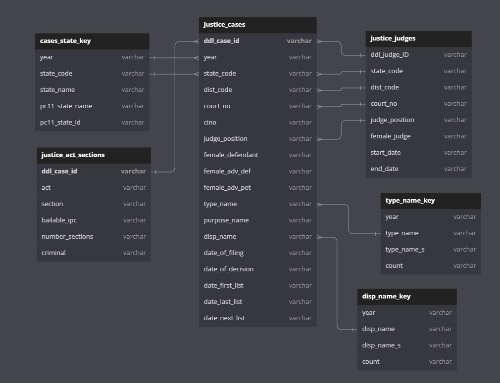

# Precog Recruitment Task

#### Explaination of the codebase
- The analysis takes the form of a 5 Jupyter notebooks containing 4 analysis points and 1 classification process. 

#### Directory structure
All files are named in a self-explanatory manner.

## Commands to run the project

To view this file, download it from this repository and start Jupyter notebook in the folder containing the file. Use the command **Jupyter notebook** on the command line.

## Dependency libraries

- pandas
- numpy
- scikit-learn
- seaborn
- matplotlib

## Approach followed

### 1. First steps
The very first step is always to check if the data needs cleaning by looking for duplicate rows, zero values, or NaNs where they shouldn't be, etc.
Upon exploring the data, I found that the memory on kaggle is insufficient for some files- leading to the usage of chunking these files. Some columns had absurd values which must be dropped.

### 2. Figuring out the Analysis Points
The way I came up with interesting points was simply by thinking of fascinating trends. Some examples are:
- State-wise analysis of `percentage of people to get convicted` over all years, but also year-wise
- Female judges giving a guilty verdict : Male judges giving a guilty verdict
- Highest Types of crimes committed in each state
- How likely is one to get convicted for the same crime in different states
- How many cases enter a court per state, and if this extends over district boundaries, basically looking for stark differences in neighbours
- As a Judge becomes more experience, does their behavior in giving verdicts change
- Percentage of divorce cases in each state
- How the average time taken to close a case has changed over the years

The points that I actually implemented:
- State-wise analysis of `percentage of people to get convicted`
- Percentage of divorce cases in each state
- Female judges giving a guilty verdict : Male judges giving a guilty verdict
- How the average time taken to close a case has changed over the years

### 3. Cleaning and using the data
- Visualised the data so the relationships are easier to spot, and merging makes sense.

- Used this graphic to figure out what tables to merge for each analysis point, and what columns were relavant to for the same.
- This resulted in a dataframe that was significantly easier to work with.

### 4. Analysis
- Now that we have all the relevant information in an organised manner, we can finally perform the analysis.
- We do this by manipulating the columns in different ways for different analysis points.
- I have tried to structure the Jupyter notebook with proper documentation. More detailed explainations are provided in the notebooks.

### 5. Classification
- A lot of work went into cleaning the data of absurd values, changing their data types, and removing nulls.
- Next, I created the heat map to figure out the columns to select as features for training.
- FInally when the data was ready to be worked with, I chose the models I would try out:
	- Logistic Regression
	- Naive Bayes
	- K-Nearest Neighbours
	- Support Vector Machine
	- Decision Tree
		- Bagging Decision Tree
		- Boosting Decision Tree
		- Random Forest
		- Voting Classifier
- After training all these models, I generated the Confusion Matrix to help understand the performance better, and also found the accuracy of the model.
---
